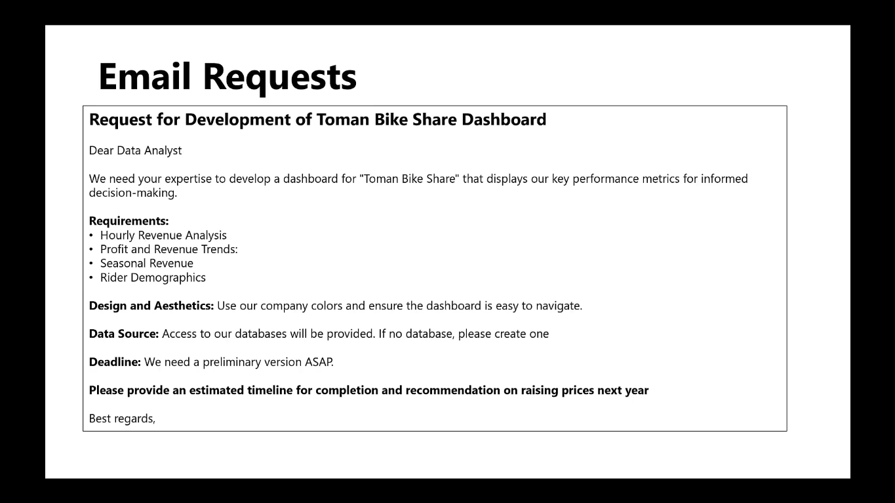
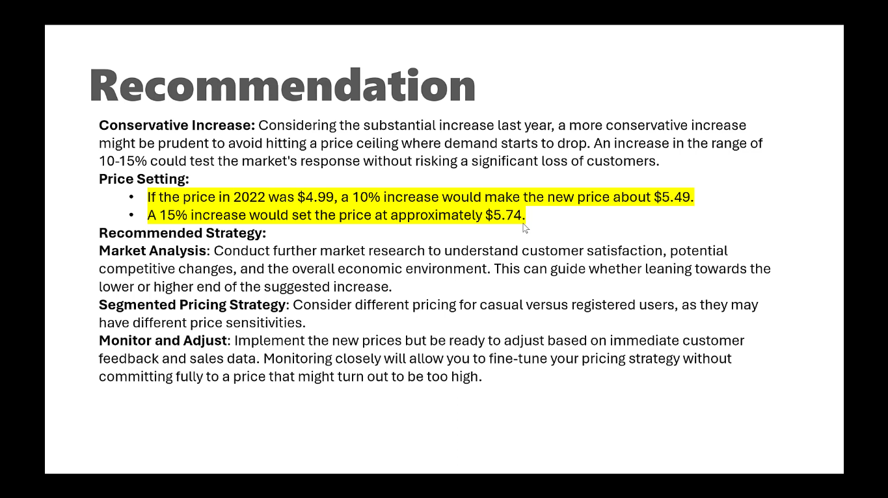

# Basic Data Analysis End-to-End Project SQL to PowerBI

## Project Description
This project demonstrates basic data analysis using SQL and Power BI. The project follows along with [this YouTube tutorial](https://www.youtube.com/watch?v=jdGJWloo-OU&t=3307s).

## Files
- **Data:**
  - `data/bike_share_yr_0.csv`
  - `data/bike_share_yr_1.csv`
  - `data/cost_table.csv`
- **Images:**
  - `Images/Use-Case.png` - Image illustrating the use case.
  - `Images/Recommendation.png` - Image showing recommendations based on the data analysis.
- **SQL Script:** `SQL/SQL Query.txt` - This text file contains the SQL script used to create the combined table.
- **Power BI Dashboard:**
  - `Power BI/Project Porfolio 1.pbix` - This is the Power BI dashboard file.
  - `Power BI/Dashboard.gif` - A GIF showing the dashboard in action.
- **Dashboard Icons:**
  - `Dashboard Icons/bicycle.png` - This was used as the logo for the company, found [here](https://www.flaticon.com/free-icon/bicycle_706201?term=bike&page=1&position=7&origin=search&related_id=706201).
  - `Dashboard Icons/people.png` - This was used as the icon representing riders, found [here](https://www.flaticon.com/free-icon/people_16000117?term=orange+user&page=1&position=1&origin=search&related_id=16000117).
  - `Dashboard Icons/coin.png` - This was used as the icon representing profit margin, found [here](https://www.flaticon.com/free-icon/coin_6369589?term=coin&page=1&position=22&origin=search&related_id=6369589).

## Steps to Reproduce

1. **Set up SQL Server:**
   - Execute the script found in `create-combined-table.txt` to create the combined table.

2. **Load Data into Power BI:**
   - Open `dashboard.pbix` in Power BI Desktop.
   - Connect to your SQL Server and refresh the data to load the latest from the combined table.

## Use Case
### Request for Development of Toman Bike Share Dashboard

Dear Data Analyst,

We need your expertise to develop a dashboard for "Toman Bike Share" that displays our key performance metrics for informed decision-making.

### Requirements:
- Hourly Revenue Analysis
- Profit and Revenue Trends
- Seasonal Revenue
- Rider Demographics

### Design and Aesthetics:
Use our company colors and ensure the dashboard is easy to navigate.

### Data Source:
Access to our databases will be provided. If no database, please create one.

### Deadline:
We need a preliminary version ASAP.

### Additional Request:
Please provide an estimated timeline for completion and recommendation on raising prices next year.

Best regards,

## Visualizations
Here’s a preview of the Power BI dashboard:

The gif of the man cycl9ing used for the dashboard is found here: [Cycling gif](https://i.pinimg.com/originals/9d/37/f2/9d37f28579591c547cca47239bad1f2c.gif).

## Recommendations

### Conservative Increase:
Considering the substantial increase last year, a more conservative increase might be prudent to avoid hitting a price ceiling where demand starts to drop. An increase in the range of 10-15% could test the market's response without risking a significant loss of customers.

### Price Setting:
- If the price in 2022 was $4.99, a 10% increase would make the new price about $5.49.
- A 15% increase would set the price at approximately $5.74.

### Recommended Strategy:
#### Market Analysis:
Conduct further market research to understand customer satisfaction, potential competitive changes, and the overall economic environment. This can guide whether leaning towards the lower or higher end of the suggested increase.

#### Segmented Pricing Strategy:
Consider different pricing for casual versus registered users, as they may have different price sensitivities.

#### Monitor and Adjust:
Implement the new prices but be ready to adjust based on immediate customer feedback and sales data. Monitoring closely will allow you to fine-tune your pricing strategy without committing fully to a price that might turn out to be too high.

## Source Tutorial
This project is based on a tutorial from [YouTube](https://www.youtube.com/watch?v=jdGJWloo-OU&t=3307s).
